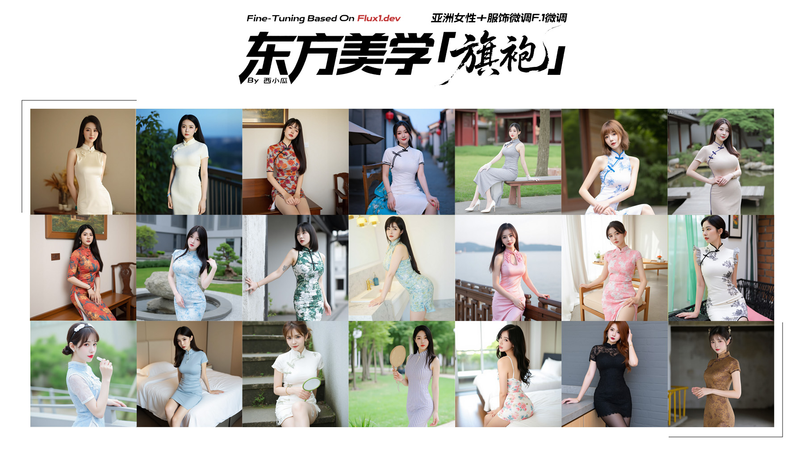

# 这是Qipao_XXG_Flux_BF16的推理演示程序
> **模型"xixiaogua/Qipao_XXG_Flux_BF16_V1"**
> 
> **demo_images/目录下为推理结果演示图像**
> 
> **By 西小瓜 / 使用问题和AI交流请联系 / Wechat:priest-mos**
> 
> 

## 🚀 快速开始
```bash
# 1. 克隆仓库
git clone https://github.com/moskoo/Qipao_XXG_Flux_BF16_TL.git
cd Qipao_XXG_Flux_BF16_TL

# 2. 安装依赖
apt-get update
apt install python3.10-venv
python3.10 -m venv .venv
source .venv/bin/activate  # Linux/Mac
# .venv\Scripts\activate   # Windows

# 步骤2-1: 安装PyTorch - 我这里使用了2.7.1 根据自己的gpu选择
# 安装CUDA 12.1版本的torch（主流显卡如3090/4090/A100）
# 安装CUDA 11.8版本的torch（老显卡如2080/1080Ti）

# ROCM 6.3 (Linux only)
python3.10 -m pip install torch==2.7.1 torchvision==0.22.1 torchaudio==2.7.1 --index-url https://download.pytorch.org/whl/rocm6.3
# CUDA 11.8
python3.10 -m pip install torch==2.7.1 torchvision==0.22.1 torchaudio==2.7.1 --index-url https://download.pytorch.org/whl/cu118
# CUDA 12.6
python3.10 -m pip install torch==2.7.1 torchvision==0.22.1 torchaudio==2.7.1 --index-url https://download.pytorch.org/whl/cu126
# CUDA 12.8
python3.10 -m pip install torch==2.7.1 torchvision==0.22.1 torchaudio==2.7.1 --index-url https://download.pytorch.org/whl/cu128
# CPU only
python3.10 -m pip install torch==2.7.1 torchvision==0.22.1 torchaudio==2.7.1 --index-url https://download.pytorch.org/whl/cpu

# 步骤2-2: 安装基础依赖
# 普通安装（推荐虚拟环境中执行）
python3.10 -m pip install -r requirements.txt

# 国内用户建议加清华源加速
python3.10 -m pip install -r requirements.txt -i https://pypi.tuna.tsinghua.edu.cn/simple

# 3. 运行主程序
python3.10 main.py
```

# XXG-Qipao



Qipao_XXG_Flux_BF16 is a model fine-tuned and merged based on flux.dev, 
Specifically designed for generating high-quality portrait photography of Asian women wearing cheongsams, with a focus on adjusting the body proportions, naturally beautiful faces, and elegant postures of Asian women. Of course, it is also friendly to other portrait images suitable for Asian women. If you have any good suggestions or questions, feel free to leave me a message in the community.

# ABOUT 
1. Using approximately 3000 high-definition photographic images to refine the 1024x1024 training data
2. Filter out photos of internet celebrities with plastic surgery faces, as most of them are ordinary beautiful faces (those with overly high aesthetic standards, I'll pass over)
3. Consider the lighting conditions in photography scenarios, and adopt a training approach that includes 30-40% indoor scenes and the remaining outdoor scenes
4. Currently, we have trained an atlas containing over 120 different styles of cheongsams
5. To minimize background interference, we have chosen simple background images for training
6. 90% of Chinese faces, 8% of Japanese faces, and 2% of Korean faces (approximately)
7. The bottom model is trained using flux1-dev
8. We will optimize the training dataset and update the training results in the future. If there is a noticeable improvement, then
9. Primarily for training on cheongsams, the skin details in the image have been smoothed, and further optimization will be carried out in the future
+ 1.采用约3000张高清摄影图片修整1024x1024训练
+ 2.过滤网红整容脸照片，日常美女脸型居多（审美过高的当我没说～）
+ 3.考虑摄影光照场景、采用30-40%的室内场景和其余的室外场景训练
+ 4.目前包含120余款不同款式旗袍服饰图集训练
+ 5.尽可能减少背景影响，选用了简洁背景图片训练
+ 6.90%的中国脸庞、8%的日本脸庞、2%的韩国脸庞（大概吧～）
+ 7.底模采用flux1-dev训练
+ 8.后续会优化训练基集更新训练结果，如果能有明显优化效果的话～
+ 9.主要是为了旗袍训练，皮肤细节部分图片是磨皮的，后续会优化～


#### Recommended negative prompt(推荐负向提示词)：
`(worst quality:2), (low quality:2), jpeg artifacts, blurry, badhandv4, easynegative, missing fingers, extra fingers, bad anatomy, plastic skin, waxy skin, greasy skin, cartoon, anime, 3d render, cgi, overexposed, underexposed, cross-eye, cloned face`


#### Realistic recommendation incorporates positive prompt words(真实感推荐加入正向提示词)：
`Professional portrait of an  Asian woman, natural outdoor lighting, shallow depth of field, bokeh background, visible skin pores, flawless skin, matte finish, 8k, ultra-detailed, DSLR photo`


#### Reference for positive prompt word combinations in indoor photography(室内拍摄正向提示词搭配参考)：
`Professional studio portrait, soft box lighting, key light on face, fill light to reduce shadow, 50mm f/1.8, sharp focus on eyes, smooth skin with visible pores, neutral gray background, 8k, ultra-detailed`


#### Reference for positive prompt word combinations in street culture(街头人文正向提示词搭配参考)：
`Street documentary portrait, candid shot, busy city street background, natural ambient light, shallow depth of field, sharp focus on subject, casual outfit, relaxed expression, 35mm f/2.0, film grain, 8k`


#### Reference for collocation of prompt words for qipao(旗袍服饰提示词搭配参考)：
`Photograph of an East Asian woman with long, straight black hair, wearing a tight, colorful cheongsam dress with floral patterns in red, orange, and blue. The dress has three-quarter sleeves, a high collar, and a slit on the left side revealing her leg.`


`Photograph of a young Asian woman with fair skin and black hair in a traditional Chinese qipao dress, seated on a wooden chair with a blue floral cloth. The dress is white with black trim and delicate floral embroidery. She has a slender build with medium-sized breasts. The woman is smiling gently, with red lipstick and subtle makeup, exuding a calm and serene presence.`


`Photograph of an Asian woman with fair skin and long black hair, wearing a silver, high-neck, sleeveless cheongsam dress with a keyhole cutout, and white, sheer, elbow-length gloves.`


`Photograph of a young woman with a fair skin tone and short, straight brown hair with bangs. She is wearing a tight, sleeveless, high-neck Chinese cheongsam-style dress in white with blue floral patterns, which accentuates her slim, petite figure and plump chest. Her legs are crossed at the ankles, and she is wearing beige, pointed-toe flats with a subtle bow detail.`


`Photograph of an East Asian woman with long, dark brown hair standing on a wooden bridge over a calm pond in a traditional chinese garden. She is wearing a form-fitting, beige, ribbed, short-sleeved cheongsam with blue decorative stitching along the sides and neckline. Her figure is hourglass-shaped, with plump chest and a slim waist. She has fair skin and a slight smile, with minimal makeup accentuating her natural beauty. Her right hand rests on her hip, and she gazes directly at the camera.`


`Photograph of a young Asian woman with pale skin and black hair in a bob cut, wearing a sleeveless, form-fitting, green and white floral Chinese cheongsam dress. She has visible tattoos on her left arm and right upper arm. She is leaning against a stone railing with her right arm resting on it, looking directly at the camera with a neutral expression.  The woman's dress has a high collar and green trim, and her makeup is subtle, enhancing her natural features.`

